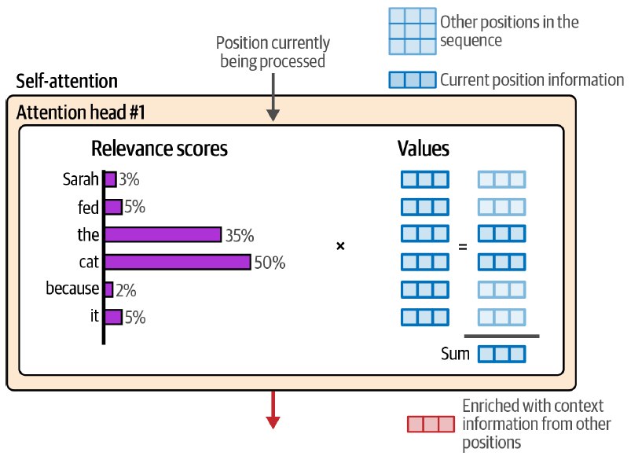
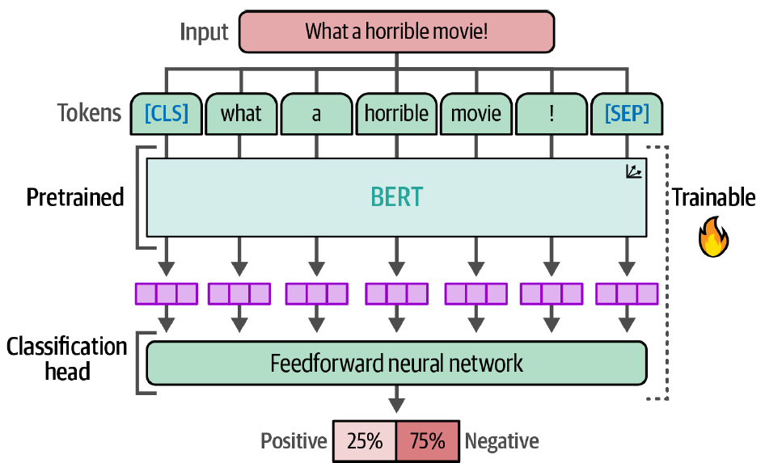

---
hide:
  - navigation
  - toc
---

  

    <h1><b>Hands-On Large Language Models</b></h1>
    
Explore the world of Large Language Models with over <b>250 custom made figures</b> in this illustrated guide!

    <a href="https://www.amazon.com/Hands-Large-Language-Models-Understanding/dp/1098150961" class="cta-button">Read the Book!</a>
  

  

  

    <b>
<h2 id="testimonials">Testimonials</h2>
</b>
    

      

        
        <h3>Andrew Ng</h3>
        
founder of DeepLearning.AI

        

        
"Jay and Maarten have continued their tradition of providing beautifully illustrated and
insightful descriptions of complex topics in their new book. Bolstered with working code,
timelines, and references to key papers, their book is a valuable resource for anyone
looking to understand the main techniques behind how Large Language Models are built.
"

      

      

        
        <h3>Nils Reimers</h3>
        
Director of Machine Learning
at Cohere | creator of sentence-transformers

        

        
"This is an exceptional guide to the world of language models and their practical
applications in industry. Its highly-visual coverage of generative, representational, and
retrieval applications of language models empowers readers to quickly understand, use,
and refine LLMs. Highly recommended!
"

      

      

        
        <h3>Josh Starmer</h3>
        
StatQuest

        

        
"I can’t think of another book that is more important to read right now. On every single
page, I learned something that is critical to success in this era of language models.
"

      

      

        
        <h3>Luis Serrano, PhD</h3>
        
Founder and CEO of Serrano Academy

        

        
"If you’re looking to get up to speed in everything regarding LLMs, look no further! In
this wonderful book, Jay and Martin will take you from zero to expert in the history
and latest advances in large language models. With very intuitive explanations, great
real-life examples, clear illustrations, and comprehensive code labs, this book lifts the
curtain on the complexities of transformer models, tokenizers, semantic search, RAG,
and many other cutting-edge technologies. A must read for anyone interested in the
latest AI technology!"

      

      

        
        <h3>Leland McInnes</h3>
        
Researcher at the Tutte Institute for
Mathematics and Computing

        

        
"Hands-On Large Language Models brings clarity and practical examples to cut through
the hype of AI. It provides a wealth of great diagrams and visual aids to supplement
the clear explanations. The worked examples and code make concrete what other books
leave abstract. The book starts with simple introductory beginnings, and steadily builds in
scope. By the final chapters, you will be fine-tuning and building your own large language
models with confidence."

      

      

        
        <h3>Prof. DDr. Roman Egger</h3>
        
CEO of Smartvisions.at
and Modul University Vienna

        

        
"Finally, a book that not only avoids superficial coverage of Large Language Models but
also thoroughly explores the background in a way that is both accessible and engaging.
The authors have masterfully created a definitive guide that will remain essential reading
despite the fast-paced advancements in the field.
"

      

    

  

  

    <h2 id="about">About the Book</h2>
    
Through the <b>visually educational</b> nature of this book and with over 250 custom made figures,  <b>Python</b> developers will learn the practical tools and concepts they need to use Large Language Models today.

    

      
      
      
    

  

  

    <h2 id="toc">Table of Contents</h2>
    

  

  

    

      <h2 id="authors">About the Authors</h2>
      
Jay Alammar is Director and Engineering Fellow at Cohere (pioneering provider of
large language models as an API). Through his popular <a href="https://jalammar.github.io/" style="color: blue;">AI blog</a>, Jay has helped millions of researchers and engineers visually understand machine learning tools and concepts from the basic to the cutting-edge
(Transformers, BERT, GPT-3, Stable Diffusion). Jay is also a co-creator of popular
machine learning and natural language processing courses on Deeplearning.ai and
Udacity.

      
Maarten Grootendorst is a Senior Clinical Data Scientist at IKNL. He holds two master's degrees in psychology and one in data science, which he leverages to create visually understandable explanations of complex machine learning concepts in his <a href="https://newsletter.maartengrootendorst.com/" style="color: blue;">AI blog</a>. He is the author and maintainer of open source packages (BERTopic, PolyFuzz, KeyBERT) that have been downloaded millions of times and used by data professionals worldwide.

    

    

      
      
    

  

